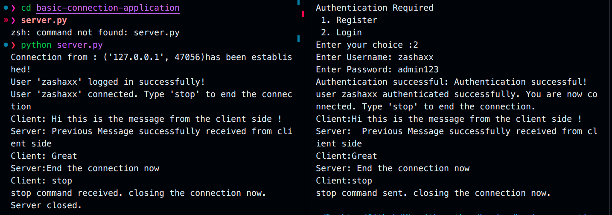
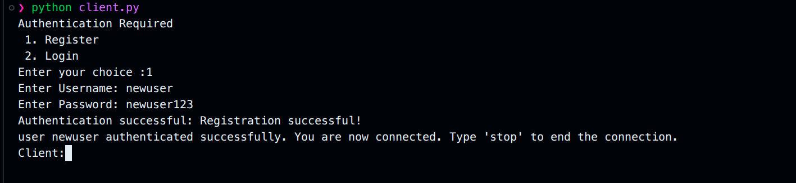
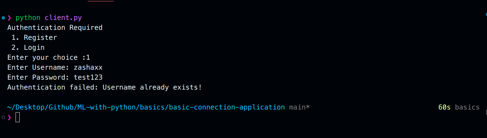

# Basic Connection Application - Output Images

## 1. Connection Working Successfully

**Description:** This image shows the successful establishment of a connection between the client and server. The server successfully accepts the client's connection request on `127.0.0.1:8080` and displays the connection confirmation message with the client's address.

---

## 2. New User Registration

**Description:** This image demonstrates the registration process for a new user. The client receives the authentication menu, selects option 1 (Register), provides a username and password, and receives a success response from the server confirming the registration.

---

## 3. Existing User Login

**Description:** This image shows the login process for an already registered user. When an existing user attempts to register again or logs in with their credentials, the system handles the authentication appropriately, showing the relevant messages for existing user scenarios.

---

## 4. Server Side Messages

**Description:** This image displays the server-side console output showing various messages and events. It includes connection establishment notifications, authentication requests handling, and database operations being performed as clients connect and authenticate.

---
